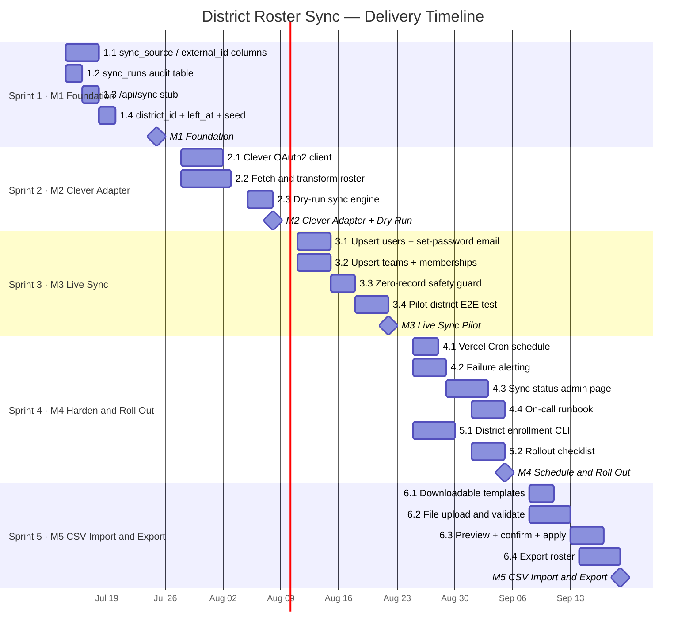

# District Roster Sync — Technical Spec & Delivery Plan

> **Status:** Draft · **Owner:** @tl · **Last updated:** 2026-07-12
>
> Tracks the end-to-end delivery of nightly district roster sync from
> Clever / ClassLink into 1-2-3 Wellness. Copy individual stories into
> GitHub Issues, Linear, or Jira — acceptance criteria are written to
> map directly to ticket descriptions.

---

## Table of Contents

1. [Problem & Goals](#1-problem--goals)
2. [Non-Goals (v1)](#2-non-goals-v1)
3. [Architecture Overview](#3-architecture-overview)
4. [Data Model Changes](#4-data-model-changes)
5. [Milestones](#5-milestones)
6. [Epics & Stories](#6-epics--stories)
7. [Risk Register](#7-risk-register)
8. [Open Questions](#8-open-questions)
9. [Definition of Done](#9-definition-of-done)
10. [Import / Export File Format & Guidelines](#10-import--export-file-format--guidelines)

---

## 1. Problem & Goals

**Current state:** Users (teachers and students) are created one-off by an admin through the UI. This doesn't scale to district-level onboarding.

**Desired state:** Each night, 1-2-3 Wellness pulls the full roster for every enrolled district from Clever or ClassLink and automatically creates, updates, and soft-deletes students, teachers, classes, and memberships — with no admin intervention. Districts or schools without a supported roster API can use a CSV or Excel upload instead, producing the same outcome through a different ingest path.

**Success metrics:**
- Nightly sync completes for all enrolled districts with zero manual steps
- Sync failures are detected and alerted within 15 minutes
- A failed sync never blocks students from logging in or checking in
- On-call can diagnose and recover from a failed run using logs alone, in < 15 min
- A non-technical admin can complete a CSV import without engineering support

---

## 2. Non-Goals (v1)

- Real-time / webhook-driven sync (nightly batch is sufficient for v1)
- ClassLink support (Clever only in v1; ClassLink in v2)
- Custom field mapping per district
- Self-serve district onboarding (admin still initiates each district connection)
- SAML / SSO (separate workstream)
- Importing wellness check-in data via CSV (roster only)

---

## 3. Architecture Overview

Two supported ingest paths. Both write through the same sync engine so idempotency and audit guarantees apply to both.

```
┌─────────────────────────────────────────────────────────────┐
│  PATH A — Automated nightly API sync                        │
│                                                             │
│  Vercel Cron (2 AM nightly)                                 │
│          │                                                  │
│          ▼                                                  │
│  POST /api/sync  ←── secret header auth                     │
│          │                                                  │
│          ▼                                                  │
│   SyncRunner (per district)                                 │
│          │                                                  │
│          ├── CleverClient.fetchRoster()                     │
│          │       └── students / teachers / sections /       │
│          │           enrollments                            │
│          │                                                  │
│          ├── Diff against DB (external_id + sync_source)    │
│          ├── Upsert users, teams, memberships               │
│          ├── Soft-delete removed memberships                │
│          └── Write sync_run audit row                       │
└─────────────────────────────────────────────────────────────┘

┌─────────────────────────────────────────────────────────────┐
│  PATH B — Manual CSV / Excel upload                         │
│                                                             │
│  Owner uploads file in /dashboard/import                    │
│          │                                                  │
│          ▼                                                  │
│  POST /api/import  ←── session auth (owner only)            │
│          │                                                  │
│          ▼                                                  │
│   ImportRunner                                              │
│          │                                                  │
│          ├── Parse & validate file (CSV or .xlsx)           │
│          ├── Compute diff (same engine as Path A)           │
│          ├── Return preview (create / update / skip counts) │
│          ├── Owner confirms → apply                         │
│          └── Write sync_run audit row (source='csv_import') │
└─────────────────────────────────────────────────────────────┘
```

**Idempotency guarantee:** Every write is keyed on `(sync_source, external_id)` for API syncs, and on `email` for CSV imports. Re-running the same file or payload produces the same DB state. Safe to retry.

**Safety rule:** If a provider or file returns 0 records for any resource type that previously had records, the sync **skips that resource and alerts** — it never deletes all users or classes.

---

## 4. Data Model Changes

### 4a. Migrations required

```sql
-- Add sync identity columns to existing tables
ALTER TABLE users
  ADD COLUMN sync_source  VARCHAR(50),
  ADD COLUMN external_id  VARCHAR(255);

CREATE UNIQUE INDEX users_sync_identity
  ON users (sync_source, external_id)
  WHERE sync_source IS NOT NULL;

ALTER TABLE teams
  ADD COLUMN sync_source  VARCHAR(50),
  ADD COLUMN external_id  VARCHAR(255),
  ADD COLUMN district_id  VARCHAR(255);

CREATE UNIQUE INDEX teams_sync_identity
  ON teams (sync_source, external_id)
  WHERE sync_source IS NOT NULL;

-- Soft-delete support for memberships
ALTER TABLE team_members
  ADD COLUMN left_at TIMESTAMP;

-- Audit log for every sync / import attempt
CREATE TABLE sync_runs (
  id              SERIAL PRIMARY KEY,
  source          VARCHAR(50)  NOT NULL,   -- 'clever' | 'csv_import' | 'classlink'
  district_id     VARCHAR(255) NOT NULL,
  started_at      TIMESTAMP    NOT NULL DEFAULT NOW(),
  completed_at    TIMESTAMP,
  status          VARCHAR(20)  NOT NULL,   -- running | success | failed | skipped
  records_seen    INTEGER,
  records_changed INTEGER,
  errors          JSONB
);
```

### 4b. External ID mapping (API sync)

| Provider concept | Our table | Match key |
|---|---|---|
| Clever `Student` | `users` (role = member) | `clever_id` → `external_id` |
| Clever `Teacher` | `users` (role = owner) | `clever_id` → `external_id` |
| Clever `Section` | `teams` | `section_id` → `external_id` |
| Clever `Enrollment` | `team_members` | derived from section + student |

**Email collision handling:** If a provider record's email matches an existing manually-created user (no `external_id`), assign the `external_id` on first sync rather than creating a duplicate. After that, `external_id` is canonical.

**Manual records are never touched:** Any user or team where `sync_source IS NULL` is ignored by the sync engine entirely.

### 4c. Match key for CSV imports

CSV imports do not have provider-assigned stable IDs. The match key is **email address** (case-insensitive). If a row's email matches an existing user, the row is treated as an update; otherwise it is an insert. See [Section 10](#10-import--export-file-format--guidelines) for full column definitions.

---

## 5. Milestones

| # | Name | Target Date | Owner | Exit Criteria |
|---|---|---|---|---|
| **M1** | Foundation | 2026-07-25 | @tl + @be1 | Migration runs on prod without downtime; `/api/sync` returns 200 with valid secret; existing users unaffected |
| **M2** | Clever Adapter + Dry Run | 2026-08-08 | @be1 + @be2 | Dry-run against Clever sandbox logs correct diffs with zero DB writes; all resource types covered |
| **M3** | Live Sync — Pilot District | 2026-08-22 | @be1 + @qa | 3 consecutive nightly syncs succeed on one real district; re-run is a no-op; synced students can log in post-sync |
| **M4** | Schedule, Harden & Roll Out | 2026-09-05 | @tl + @devops | 5+ districts syncing nightly via Vercel Cron; on-call runbook complete; zero student login disruptions over 2-week observation |
| **M5** | CSV / Excel Import & Export | 2026-09-19 | @fe + @be1 | Non-technical admin completes full school import from CSV without engineering support; export downloads correct roster |

**Sprint cadence:** 2-week sprints starting 2026-07-14. M1–M4 = Sprints 1–4. M5 = Sprint 5.



---

## 6. Epics & Stories

Story point scale: **1** (trivial) · **2** (small) · **3** (medium) · **5** (large) · **8** (extra-large) · **13** (spike / needs breakdown)

---

### Epic 1 — Data Model Foundation
> Milestone: M1 · Owner: @tl

Lay the schema and API surface that all later epics build on. No sync logic yet.

---

#### Story 1.1 — Add `sync_source` / `external_id` to users and teams
**Points:** 3 · **Assignee:** @be1 · **Milestone:** M1

**As a** sync engineer,
**I want** users and teams to carry a `(sync_source, external_id)` pair,
**so that** I can upsert provider records without creating duplicates.

**Acceptance criteria:**
- [ ] Migration adds `sync_source VARCHAR(50)` and `external_id VARCHAR(255)` to both `users` and `teams`
- [ ] Unique partial index on `(sync_source, external_id) WHERE sync_source IS NOT NULL` on both tables
- [ ] Existing rows have `NULL` for both columns and are unaffected
- [ ] Migration is reversible (down migration exists)
- [ ] CI passes against a fresh DB and against a seeded DB

---

#### Story 1.2 — Create `sync_runs` audit table
**Points:** 2 · **Assignee:** @be1 · **Milestone:** M1

**As an** on-call engineer,
**I want** every sync attempt recorded with status and error detail,
**so that** I can diagnose failures without reading raw logs.

**Acceptance criteria:**
- [ ] `sync_runs` table created with columns: `id`, `source`, `district_id`, `started_at`, `completed_at`, `status`, `records_seen`, `records_changed`, `errors JSONB`
- [ ] `source` accepts `'clever'`, `'classlink'`, and `'csv_import'`
- [ ] Status enum enforced at the application layer: `running | success | failed | skipped`
- [ ] `errors` stores structured error objects (code, message, affected IDs), not raw stack traces
- [ ] PII (names, emails) is never written to `errors`

---

#### Story 1.3 — Auth-gated `/api/sync` endpoint stub
**Points:** 2 · **Assignee:** @be1 · **Milestone:** M1

**As a** scheduler,
**I want** a POST endpoint that accepts a district ID and returns 200,
**so that** the cron job has a stable target to call before sync logic is wired up.

**Acceptance criteria:**
- [ ] `POST /api/sync` accepts `{ districtId, source }` body
- [ ] Requires `Authorization: Bearer <SYNC_SECRET>` header; returns 401 otherwise
- [ ] Returns `{ status: "ok", districtId }` (stub response for now)
- [ ] `SYNC_SECRET` is an env var, never hardcoded
- [ ] Route is excluded from Next.js middleware session checks

---

#### Story 1.4 — Add `district_id` to teams + `left_at` to memberships + seed one test district
**Points:** 2 · **Assignee:** @be1 · **Milestone:** M1

**Acceptance criteria:**
- [ ] `district_id VARCHAR(255)` added to `teams`
- [ ] `left_at TIMESTAMP` added to `team_members` (NULL = active member)
- [ ] Seed script creates one team with `sync_source = 'clever'`, `external_id = 'test-section-1'`, `district_id = 'test-district-1'` for integration tests
- [ ] Existing seed data unchanged

---

### Epic 2 — Clever Adapter
> Milestone: M2 · Owner: @be2

Build the API client and data transformation layer for Clever. All writes are dry-run only during this epic.

---

#### Story 2.1 — Clever OAuth2 client
**Points:** 5 · **Assignee:** @be2 · **Milestone:** M2

**As a** sync engineer,
**I want** an authenticated Clever API client,
**so that** I can fetch roster data without managing tokens manually.

**Acceptance criteria:**
- [ ] `lib/sync/clever/client.ts` wraps Clever's OAuth2 Bearer token flow
- [ ] Token cached in memory for the process lifetime; refreshed on 401
- [ ] Supports pagination (`starting_after` cursor) for all list endpoints
- [ ] Rate limit headers respected; backs off with exponential retry on 429
- [ ] Client accepts a `districtId` and scopes all requests to that district
- [ ] Clever credentials (`CLEVER_CLIENT_ID`, `CLEVER_CLIENT_SECRET`) stored as env vars
- [ ] Unit tests cover token refresh and pagination logic (mock HTTP)

---

#### Story 2.2 — Fetch and transform Clever roster
**Points:** 8 · **Assignee:** @be2 · **Milestone:** M2

**As a** sync engineer,
**I want** the Clever adapter to return our internal domain types,
**so that** the sync engine doesn't need to know anything about Clever's API shape.

**Acceptance criteria:**
- [ ] Fetches `/v3.0/districts/:id/students`, `/teachers`, `/sections`, `/enrollments`
- [ ] Transforms to internal types: `SyncUser`, `SyncTeam`, `SyncMembership`
- [ ] `SyncUser` includes: `externalId`, `name`, `email`, `role (owner|member)`
- [ ] `SyncTeam` includes: `externalId`, `name`, `districtId`
- [ ] `SyncMembership` includes: `userExternalId`, `teamExternalId`, `role`
- [ ] Missing or null `email` on a student throws a typed `SyncValidationError` (skips that record, logs it)
- [ ] Integration test runs against Clever sandbox and asserts expected record counts

---

#### Story 2.3 — Dry-run mode in sync engine
**Points:** 5 · **Assignee:** @be1 + @be2 · **Milestone:** M2

**As a** tech lead,
**I want** to run the sync in dry-run mode and see exactly what would change,
**so that** I can validate correctness before touching production data.

**Acceptance criteria:**
- [ ] Sync engine accepts a `dryRun: boolean` flag
- [ ] When `dryRun = true`: computes the diff (creates, updates, deletes) and logs it, but executes zero DB writes
- [ ] Diff output includes: counts of would-create / would-update / would-skip / would-soft-delete per resource type
- [ ] `sync_runs` row written with `status = 'skipped'` and diff counts in `records_seen`
- [ ] POST `/api/sync` accepts `?dryRun=true` query param (admin only)
- [ ] Re-running dry-run on the same payload produces identical output (deterministic)

---

### Epic 3 — Sync Engine (Live Writes)
> Milestone: M3 · Owner: @be1

Wire the Clever adapter output into actual DB upserts. One pilot district validates end-to-end before any further rollout.

---

#### Story 3.1 — Upsert users from roster
**Points:** 5 · **Assignee:** @be1 · **Milestone:** M3

**Acceptance criteria:**
- [ ] New users are inserted with `sync_source`, `external_id`, `name`, `email`, `role`
- [ ] Existing users (matched by `external_id + sync_source`) have `name` and `email` updated if changed
- [ ] Users with `sync_source IS NULL` (manually created) are never modified
- [ ] Email collision with a manual user: assign `external_id` and `sync_source` to the existing row; do not create a duplicate
- [ ] Synced users are created without a `passwordHash`. On their first login attempt, the auth flow detects the missing password and sends a "set your password" email to their roster address. This must be implemented and tested before M3 pilot go-live (tracked as a dependency in Story 3.4)
- [ ] The set-password email link expires after 24 hours and is single-use
- [ ] Upsert is a single `INSERT ... ON CONFLICT DO UPDATE` per batch (not N individual queries)

---

#### Story 3.2 — Upsert teams and sync memberships
**Points:** 5 · **Assignee:** @be1 · **Milestone:** M3

**Acceptance criteria:**
- [ ] New teams inserted with `sync_source`, `external_id`, `district_id`, `name`
- [ ] Existing teams updated (name changes flow from provider)
- [ ] New memberships inserted; existing memberships left unchanged
- [ ] Removed memberships (present in DB, absent from provider payload) are soft-deleted: `left_at = NOW()` set on the `team_members` row rather than hard-deleted
- [ ] A student removed then re-added gets their `left_at` cleared (`NULL`)
- [ ] Teams with zero enrollments are created but left empty (not an error)

---

#### Story 3.3 — Zero-record safety guard
**Points:** 3 · **Assignee:** @be1 · **Milestone:** M3

**As an** on-call engineer,
**I want** the sync to refuse to delete everyone if the provider returns an empty payload,
**so that** a provider outage can never wipe a district's active users.

**Acceptance criteria:**
- [ ] If provider returns 0 students OR 0 teachers OR 0 sections for a district that previously had records, sync marks the run `status = 'skipped'`, writes the count to `sync_runs.errors`, and does not modify any users or teams
- [ ] Alert fires (see Epic 4) when a skip occurs
- [ ] A district with legitimately 0 records (brand-new, never synced) is allowed through
- [ ] Threshold is configurable per district (`min_expected_students`, defaulting to 1 for any previously-synced district)

---

#### Story 3.4 — Manual trigger + pilot district end-to-end test
**Points:** 3 · **Assignee:** @be1 + @qa · **Milestone:** M3

**Acceptance criteria:**
- [ ] Admin can trigger sync for a specific district via `POST /api/sync { districtId, source }` with the secret header
- [ ] Running the same trigger twice produces no changes on the second run (idempotent)
- [ ] Pilot district teacher and students can log in and submit check-ins after sync (set-password email flow verified)
- [ ] `sync_runs` row shows `status = 'success'` with correct record counts
- [ ] QA sign-off: 3 consecutive nightly syncs complete on pilot district with no manual intervention

---

### Epic 4 — Scheduling, Observability & Failure Handling
> Milestone: M4 · Owner: @tl + @devops

Run the sync on a schedule, make failures visible, and give on-call the tools to recover without engineering support.

---

#### Story 4.1 — Vercel Cron nightly schedule
**Points:** 2 · **Assignee:** @devops · **Milestone:** M4

**Acceptance criteria:**
- [ ] `vercel.json` configures a cron job: `POST /api/sync/all` nightly at 02:00 UTC
- [ ] `/api/sync/all` iterates all enrolled districts and calls the sync engine for each
- [ ] Each district sync runs sequentially (not parallel) to avoid DB connection exhaustion
- [ ] Hard timeout: if a single district sync exceeds 25 min, it is marked `failed` and the loop continues to the next district
- [ ] Cron job auth uses the same `SYNC_SECRET` mechanism as the manual trigger

---

#### Story 4.2 — Failure alerting
**Points:** 3 · **Assignee:** @be1 + @devops · **Milestone:** M4

**Acceptance criteria:**
- [ ] On `status = 'failed'` or `status = 'skipped'`, a POST is sent to a configurable webhook URL (`ALERT_WEBHOOK_URL` env var)
- [ ] Alert payload includes: district ID, status, error summary, timestamp, link to relevant `sync_runs` row
- [ ] Webhook tested with Slack (format renders correctly in #alerts channel)
- [ ] No alert fires for `status = 'success'`
- [ ] If `ALERT_WEBHOOK_URL` is unset, alerting is skipped silently (no crash)

---

#### Story 4.3 — Sync status admin page
**Points:** 5 · **Assignee:** @fe + @be1 · **Milestone:** M4

**As a** teacher admin or 123 Wellness staff member,
**I want** to see the sync status for each district at a glance,
**so that** I don't need to query the database to know if last night's sync worked.

**Acceptance criteria:**
- [ ] `/dashboard/sync-status` page (owner-only; students redirected)
- [ ] Shows a table: district name, last sync time, source (`clever` / `csv_import`), status badge (✅ success / ⚠️ skipped / ❌ failed), records changed
- [ ] Expandable row shows error detail from `sync_runs.errors` if status is not `success`
- [ ] Data refreshes on page load (no polling needed for v1)
- [ ] Page is read-only; no actions available in v1

---

#### Story 4.4 — On-call runbook
**Points:** 2 · **Assignee:** @tl · **Milestone:** M4

**Acceptance criteria:**
- [ ] `docs/sync-runbook.md` created covering: how to check last sync status, how to manually re-trigger, how to interpret error codes, how to safely disable sync for one district, escalation path if sync is broken for > 24 hours
- [ ] Reviewed by at least one engineer who was not the author
- [ ] Linked from the sync status admin page

---

### Epic 5 — District Onboarding & Rollout
> Milestone: M4 · Owner: @pm + @tl

The process and tooling for onboarding each new district safely.

---

#### Story 5.1 — District enrollment CLI / admin action
**Points:** 3 · **Assignee:** @be1 · **Milestone:** M4

**As a** 123 Wellness admin,
**I want** to enroll a new district for sync with a single command or form,
**so that** sales can onboard a new customer without an engineering deploy.

**Acceptance criteria:**
- [ ] `npm run district:enroll -- --source=clever --districtId=<id> --name="Springfield USD"` creates a district record and stores Clever credentials
- [ ] Running enroll for an already-enrolled district updates credentials (idempotent)
- [ ] After enroll, a dry-run is automatically triggered and the diff is printed to stdout
- [ ] No district is activated for nightly sync until an engineer approves the dry-run output

---

#### Story 5.2 — Rollout checklist (per district)
**Points:** 1 · **Assignee:** @pm · **Milestone:** M4

**Acceptance criteria:**
- [ ] `docs/district-onboarding-checklist.md` documents the steps: Clever app approval → credentials stored → dry-run reviewed → live sync approved → pilot users verified → nightly cron activated
- [ ] Each step has a clear owner (Sales, Engineering, or Customer Success)
- [ ] Checklist is tracked per district in a shared doc (Notion / Linear project)

---

### Epic 6 — CSV / Excel Bulk Import & Export
> Milestone: M5 · Owner: @fe + @be1

Provides a roster ingest path for schools and districts that do not use Clever or ClassLink. Also allows any admin to export their current roster for auditing or migration purposes. Both import and export go through the same sync engine as the API path — no separate code path for writes.

---

#### Story 6.1 — Downloadable roster templates
**Points:** 2 · **Assignee:** @fe · **Milestone:** M5

**As a** school admin,
**I want** a pre-formatted template to fill in,
**so that** I don't have to guess which columns are required or how to format the data.

**Acceptance criteria:**
- [ ] `/dashboard/import` page (owner-only) offers "Download CSV template" and "Download Excel template" buttons
- [ ] CSV template: UTF-8 with BOM, headers on row 1, one example student row, one example teacher row (rows marked with `# EXAMPLE — DELETE ME`)
- [ ] Excel (.xlsx) template: same data, column headers bolded, required columns highlighted yellow, a "Field Guide" sheet describing every column and valid values
- [ ] Both templates include all columns defined in [Section 10](#10-import--export-file-format--guidelines)
- [ ] Template version is embedded in the filename: `123wellness-roster-template-v1.csv`

---

#### Story 6.2 — File upload, parse, and validate
**Points:** 5 · **Assignee:** @be1 · **Milestone:** M5

**As a** school admin,
**I want** the system to catch mistakes in my file before anything is imported,
**so that** I can fix errors without having to undo a bad import.

**Acceptance criteria:**
- [ ] `POST /api/import` accepts multipart form data with a single file field (`roster`)
- [ ] Accepts `.csv` and `.xlsx` only; returns 400 with a clear message for any other format
- [ ] Maximum file size: 5 MB. Maximum rows: 10,000. Exceeding either returns a descriptive error.
- [ ] Parser detects encoding; accepts UTF-8 and UTF-8-with-BOM
- [ ] Required column validation: returns a structured list of errors by row number if `email`, `name`, or `role` are missing or invalid
- [ ] `role` must be `student` or `teacher` (case-insensitive); any other value is flagged per row
- [ ] Email format validated per row (RFC 5322 basic check)
- [ ] Duplicate emails within the file are flagged (last row wins with a warning, not a hard error)
- [ ] On success, returns a preview object: `{ toCreate: N, toUpdate: N, toSkip: N, errors: [...] }` — no DB writes yet
- [ ] Errors in the response include row number, column name, and a human-readable message

---

#### Story 6.3 — Preview confirmation and apply
**Points:** 3 · **Assignee:** @fe + @be1 · **Milestone:** M5

**As a** school admin,
**I want** to review what the import will do before it runs,
**so that** I don't accidentally overwrite data I didn't intend to change.

**Acceptance criteria:**
- [ ] After upload + validation, the UI shows the preview summary: X new users, Y updated, Z skipped (with skip reasons)
- [ ] Admin must click "Confirm Import" to apply — no auto-apply
- [ ] On confirm, `POST /api/import/apply` applies the same validated payload to the DB using the standard upsert engine
- [ ] Apply is idempotent: re-uploading the same file a second time produces no changes
- [ ] A `sync_runs` row is written with `source = 'csv_import'`, correct counts, and `status = 'success'` or `'failed'`
- [ ] On completion, the UI shows a success summary or a per-row error list
- [ ] Any rows that failed to apply are listed with their error; successfully applied rows are not rolled back due to another row's failure (partial success is allowed)

---

#### Story 6.4 — Export current roster
**Points:** 3 · **Assignee:** @fe + @be1 · **Milestone:** M5

**As a** school admin,
**I want** to download the current roster as a CSV or Excel file,
**so that** I can audit who has access, migrate to another system, or hand it off to IT.

**Acceptance criteria:**
- [ ] `/dashboard/import` page includes "Export Roster" with CSV and Excel options
- [ ] Export includes: `name`, `email`, `role`, `class_name` (comma-separated if multiple), `sync_source`, `joined_at`
- [ ] Export does **not** include: passwords, check-in notes, wellness data, internal user IDs
- [ ] Students who have `left_at` set on all their memberships are excluded from the export by default; an "Include inactive" checkbox adds them back with an `active` column (`true`/`false`)
- [ ] Excel export: column headers bolded, dates formatted as `YYYY-MM-DD`, one row per user
- [ ] CSV export: UTF-8 with BOM (for Excel compatibility on Windows), RFC 4180 compliant
- [ ] Export is owner-only; students and unauthenticated requests return 403
- [ ] Filename includes the date: `123wellness-roster-2026-07-12.csv`

---

## 7. Risk Register

| # | Risk | Likelihood | Impact | Mitigation |
|---|---|---|---|---|
| R1 | Provider returns empty payload, wiping a district | Low | Critical | Zero-record guard (Story 3.3) skips run and alerts |
| R2 | Email collision between synced and manual users | Medium | High | Match by email on first sync, assign `external_id`; unique index prevents future dupes |
| R3 | Sync runs long and collides with school start time | Medium | Medium | Hard 25-min timeout per district (Story 4.1); run at 2 AM UTC |
| R4 | Clever API rate limits during full roster fetch | Medium | Medium | Pagination + exponential backoff (Story 2.1); stagger multi-district runs |
| R5 | PII in sync error logs (student names/emails) | Low | High | Structured errors store IDs only, never names or emails (Story 1.2) |
| R6 | A removed student retains access after sync | Low | High | Soft-delete sets `left_at`; auth middleware checks this field before allowing login |
| R7 | Sync secret leaked / endpoint hit by unauthorized caller | Low | Critical | Secret rotated quarterly; 401 on mismatch; endpoint not in public docs |
| R8 | Schema migration causes downtime on a large users table | Medium | High | Run migration during low-traffic window; test on a copy of prod data first |
| R9 | Malformed or non-UTF-8 CSV causes parser crash | Medium | Medium | Validate encoding before parsing; return 400 with a human-readable error (Story 6.2) |
| R10 | Admin exports roster and stores it insecurely | Medium | High | Export contains no wellness data; add a download warning banner: "This file contains PII — handle per your district's data policy" |
| R11 | Large import file (10k rows) times out on Vercel's 60s function limit | Low | Medium | Stream parse + chunk upserts in batches of 500; return a job ID for async status polling if needed |

---

## 8. Open Questions

These need answers from Angel / Drew before building begins.

| # | Question | Asked | Owner | Needed by |
|---|---|---|---|---|
| Q1 | Is there one Clever OAuth app per district, or one shared app for all districts? | 2026-07-12 | @pm | M2 start |
| Q2 | Should a student removed from the roster lose login access immediately, or have a grace period (e.g. 30 days)? | 2026-07-12 | @pm + legal | M3 start |
| Q3 | Are there classes that must stay manual and be excluded from sync? | 2026-07-12 | @pm | M2 start |
| Q4 | What is the SLA if sync fails — same-day fix, or next-cycle (24h) is acceptable? | 2026-07-12 | @pm | M4 start |
| Q5 | Does sending student notes to a future LLM-scoring API create FERPA / COPPA obligations we need legal sign-off on? | 2026-07-12 | legal | Before any LLM feature |
| Q6 | Do we need ClassLink support before the first paid district goes live? | 2026-07-12 | @pm | M1 start |
| Q7 | For schools using CSV import: who is responsible for keeping the file up to date — IT, the admin, or Customer Success? This affects how often re-imports are expected and whether we need to prompt admins. | 2026-07-12 | @pm | M5 start |

---

## 9. Definition of Done

A story is **done** when all of the following are true:

- [ ] All acceptance criteria checked off and verified by a second engineer
- [ ] Unit and/or integration tests cover the happy path and at least one failure mode
- [ ] No PII (student names, emails) appears in logs or error payloads
- [ ] Code reviewed and approved by @tl
- [ ] Relevant docs updated (runbook, onboarding checklist, or this spec)
- [ ] Feature deployed to staging and smoke-tested
- [ ] `sync_runs` audit row written correctly for any code path that touches the sync engine
- [ ] No regression in existing check-in or auth flows (verified by QA)

A **milestone** is done when:

- [ ] All stories for that milestone meet the Definition of Done above
- [ ] Exit criteria in the [Milestones](#5-milestones) table are met and signed off by @tl and @pm
- [ ] Retrospective held and action items logged

---

## 10. Import / Export File Format & Guidelines

This section defines the canonical file format for CSV and Excel roster imports and exports. It is the authoritative reference for template generation (Story 6.1), parser validation (Story 6.2), and export shape (Story 6.4).

---

### 10a. Import column definitions

| Column | Required | Format | Valid values / notes |
|---|---|---|---|
| `email` | **Yes** | Text | Valid email address. Used as the match key — must be unique within the file. Case-insensitive. |
| `name` | **Yes** | Text | Full name. Max 255 characters. |
| `role` | **Yes** | Text | `student` or `teacher` (case-insensitive). `student` maps to `role = member`; `teacher` maps to `role = owner`. |
| `class_name` | No | Text | Name of the class / section to enroll this person in. If the class does not exist it will be created. To enroll in multiple classes, repeat the row with a different `class_name`. |
| `external_id` | No | Text | Your system's stable ID for this person (SIS ID, etc.). Stored as `external_id` with `sync_source = 'csv_import'`. If omitted, email is used as the match key only. |
| `district_id` | No | Text | Groups classes under a district. Required if you are importing multiple schools in one file. |

**Rules:**
- Row 1 must be the header row. Column order does not matter, but names must match exactly (case-insensitive).
- Blank rows are silently skipped.
- Rows starting with `#` are treated as comments and skipped.
- If a row's email matches an existing user, **only `name` and `class_name` are updated** — role is never downgraded by an import.
- Users already in the system via a Clever sync (`sync_source = 'clever'`) will not be modified by a CSV import. Their row will appear in the preview as `skipped (managed by Clever)`.

---

### 10b. Export column definitions

| Column | Notes |
|---|---|
| `name` | User's full name |
| `email` | User's email address |
| `role` | `student` or `teacher` |
| `class_name` | Comma-separated list of classes the user belongs to |
| `sync_source` | `clever`, `csv_import`, or blank (manually created) |
| `external_id` | Provider or import ID, if set |
| `joined_at` | ISO 8601 date the user was created in 1-2-3 Wellness (`YYYY-MM-DD`) |
| `active` | `true` / `false`. Only present when "Include inactive" is checked. |

Wellness data (check-in notes, emotions, sentiment scores) is **never included in exports.**

---

### 10c. File encoding and formatting

**CSV:**
- Encoding: UTF-8 with BOM (`\xEF\xBB\xBF` prefix). Required for correct display when opened in Excel on Windows.
- Line endings: CRLF (`\r\n`) for maximum Excel compatibility.
- Quoting: any field containing a comma, double-quote, or newline must be wrapped in double-quotes. Internal double-quotes are escaped as `""`. (RFC 4180)
- Date fields: ISO 8601 (`YYYY-MM-DD`).

**Excel (.xlsx):**
- Generated with a library that writes true OOXML (e.g. `exceljs`), not CSV-renamed-as-xlsx.
- Sheet 1: `Roster` — the data.
- Sheet 2: `Field Guide` — one row per column with name, required flag, description, and example value.
- Required columns highlighted yellow in row 1.
- Date columns formatted as `YYYY-MM-DD` (not a locale-specific date serial).
- Max column width: 50 characters (auto-fit up to that cap).

---

### 10d. Validation error format

When the import API returns validation errors, each error object follows this shape:

```json
{
  "row": 4,
  "column": "email",
  "value": "not-an-email",
  "message": "Invalid email address"
}
```

The API response wraps errors in:

```json
{
  "valid": false,
  "preview": null,
  "errors": [ ...error objects... ]
}
```

A file with any hard errors returns `valid: false` and cannot be applied until the errors are fixed. Warnings (e.g. duplicate email within file) appear in a separate `warnings` array and do not block import.

---

### 10e. PII and data handling notice

> **For admins:** The export file contains personally identifiable information (names and email addresses of students and staff). Handle it according to your district's data governance policy. Do not share it outside of authorized personnel. Delete the file when it is no longer needed.
>
> **For engineers:** The export endpoint is owner-only and must never be accessible without an active authenticated session. The import endpoint must log only row numbers and error codes — never the raw cell values — to `sync_runs.errors`.
